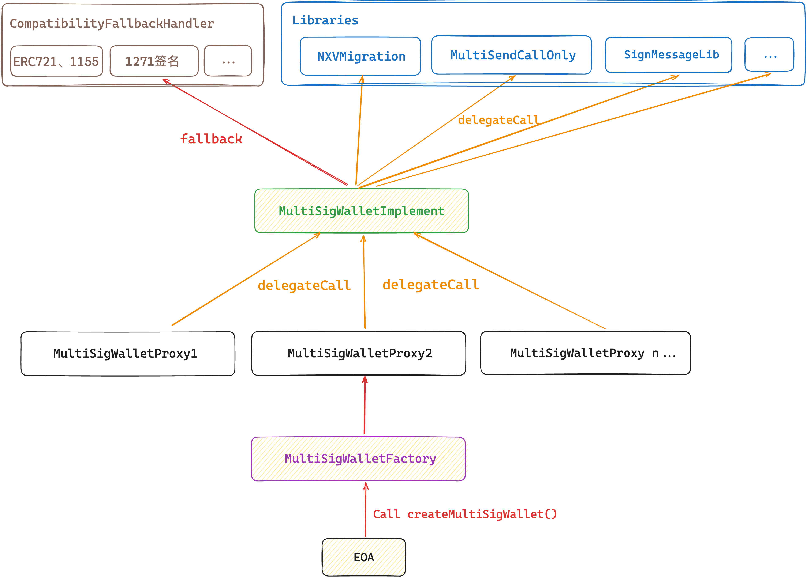

# NXV-Wallet Project

MultiSig Wallet based [GnosisSafe Wallet(old)](https://github.com/gnosis/MultiSigWallet/blob/master/contracts/MultiSigWallet.sol) with EIP-712 Sign Style and Multi Call Support.

### I. Architecture



### II. Init

```shell
npm i
```

### III. Compile Contract & Run Hardhat node
```shell
npx hardhat compile
npx hardhat node
```

### IV. Deploy Contract

```shell
# deploy and verify all contracts in one command (goerli: --network goerli)
npx hardhat deploy-contracts --network localhost

# deploy MultiSigWalletFactory and MultiSigWalletImplementation
npx hardhat deploy-factory 
npx hardhat deploy-walletImplementation 
# deploy FallBackHandler (fallback)
npx hardhat deploy-fallbackHandler 
# deploy libraries (through delegateCall, MultiSigWalletImplementation can implement multicall and upgrade functions, etc.)
## multiSendCallOnly (only allow wallet contract Call other contracts, forbid delegateCall)
npx hardhat deploy-multiSendCallOnly 
## multiSend (allow wallet contract delegateCall other contracts)
npx hardhat deploy-multiSend 
## upgrade implementation
npx hardhat deploy-migration 
## allow wallet contract sign 1271 message onChain
npx hardhat deploy-signMessageLib 
```

- MultiSigWalletFactory: `0x2e5F103C1b1389C1440e383cFEF13a6C59a181c8`

- MultiSigWalletImplementation: `0x49215ea0FeDbaD8D3C3799954310f302AaF5D780`

- CompatibilityFallbackHandler: `0x1D4b8C421E09a17Dcf6746d6A07c5803A59Fc6FC`

- MultiSendCallOnly: `0xFB72a061CbD459A91bb8c34795831cefC9EC48C4`

- MultiSend: `0xa1121a7A9ea4878691313dE01BcC82882071734C`

- SignMessageLib: `0xC9D25e3f6bD8520CF4F23cfA96f3eaed2e75fe1A`

### V. Create MultiSigWallet

```shell
npx hardhat run scripts/0.create_wallet.ts 
```

### VI. Others Scrtips

```shell
# Create MultiSigWallet with transaction
npx hardhat run scripts/0.create_wallet_with_transaction.ts

# Transfer ETH from MultiSigWallet with batchSignature method
npx hardhat run scripts/1.call_wallet_transferETH.ts

# Upgrade MultiSigWalletImplementation
npx hardhat run scripts/2.upgrade_singleton.ts

# Sign 1271 message offChain
npx hardhat run scripts/3.1271_validSig.ts

# Process ERC721 receive
npx hardhat run scripts/4.nft_receive.ts

# Process multiCall from MultiSigWallet
npx hardhat run scripts/5.multiCall.ts

# Process multiCall from MultiSigWallet, forbid delegateCall (recommend)
npx hardhat run scripts/5.multiCallOnly.ts

# Owner operation
npx hardhat run scripts/6.addOwner.ts
npx hardhat run scripts/6.removeOwner.ts
npx hardhat run scripts/6.swapOwner.ts 

# Sign 1271 message onChain
npx hardhat run scripts/7.signMsgOnchain.ts 

# Simulate transaction
npx hardhat run scripts/8.simulate.ts 
```

### VII. Verify Contract

```shell
# Constructor arguments are not required if using Sourcify verification
npx hardhat verify CONTRACT_ADDRESS "Constructor argument 1" 
```

### VIII. Test Contract

```shell
# test all contracts
npx hardhat test
# test CompatibilityFallbackHandler contract
npx hardhat test test/handlers/CompatibilityFallbackHandler.spec.ts
```

### IX. Deployed Addresses

<!-- Please see [deployed.md](./deployed.md) -->
